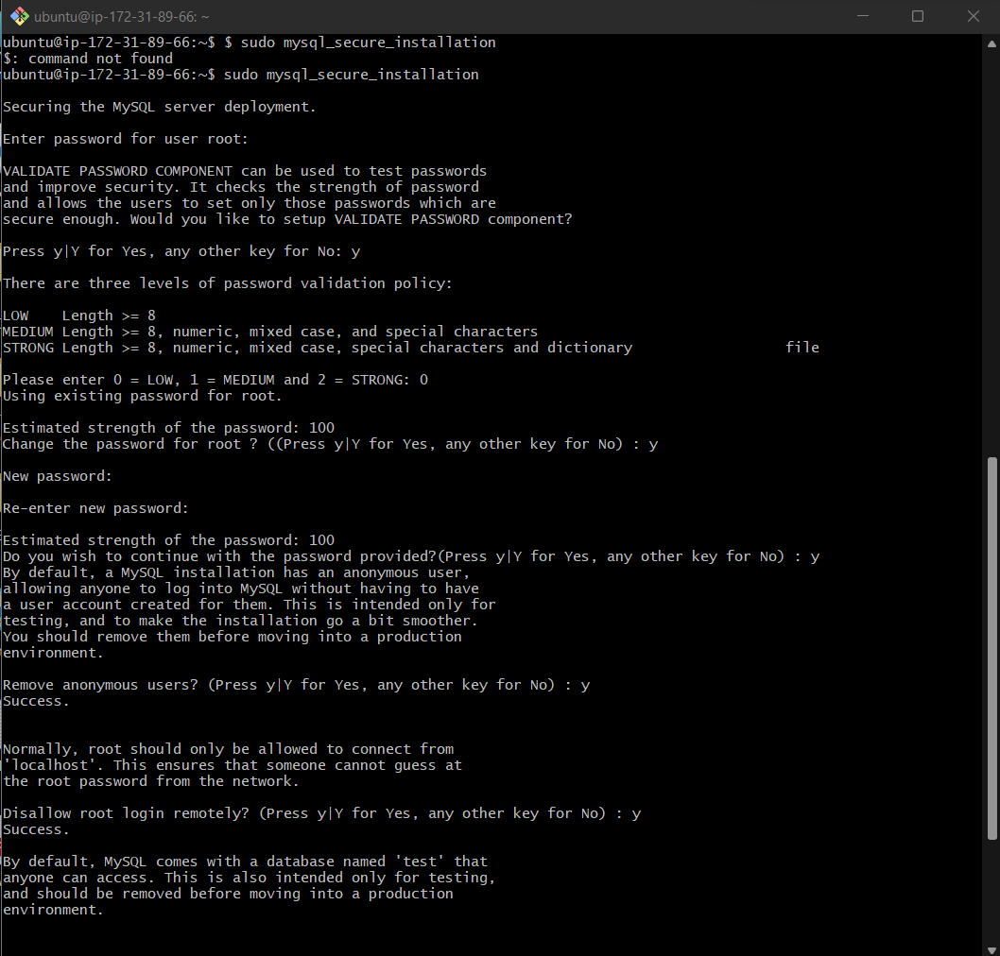
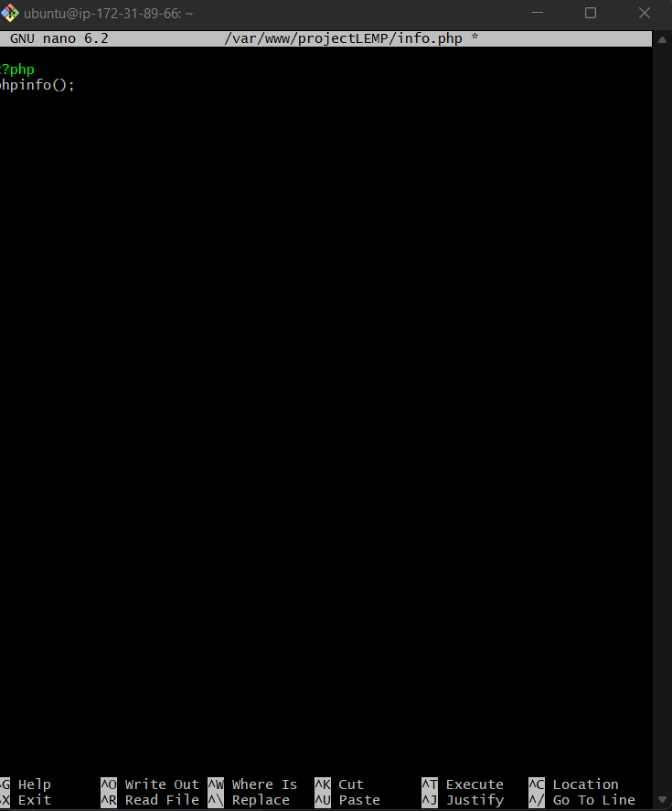

# WEB STACK IMPLEMENTATION (LEMP STACK)

A software stack is a set of layered tools, libraries, programming languages, and technologies used for building, managing, and running an application. 

The stack consists of software components that support the application in different ways, such as visual presentation, database, networking, and security.

LEMP is an open-source web application stack used to develop web applications. 

The term LEMP is an acronym that represents L for the Linux Operating system, Nginx (pronounced as engine-x, hence the E in the acronym) web server, M for MySQL database, and P for PHP scripting language.

LEMP Stands For:

- L- Linux Operating System
- E- Nginx Server
- M- MySQL Database
- P- PHP

LEMP enjoys good community support and is used around the world in many highly-scaled web applications. Nginx is the second most widely used web server in the world following Apache.

The LEMP stack is a combination of four open-source technologies that are used in web development. These technologies include:

- Linux: The operating system that runs the web server.
- Nginx: The web server software that handles HTTP requests.
- MySQL: The relational database management system that stores the website’s data.
- PHP: The programming language used to build dynamic web applications

## LEMP STACK WORK SYSTEM

The LEMP stack works by using Nginx as the web server, which listens for HTTP requests and forwards them to the appropriate PHP script. 

The PHP script generates a response, which is then sent back to the user via Nginx.

MySQL is used to store and manage the website’s data. 

PHP communicates with MySQL to retrieve and store data as needed.

## LEMP STACK POPULARITY IN WEB DEVELOPMENT

The LEMP stack is popular in web development for several reasons:

1. High performance: Nginx is known for its high performance, making it an excellent choice for handling large amounts of traffic.

2. Scalability: The LEMP stack is highly scalable, making it a good choice for websites that need to handle a large volume of traffic.

3. Open-source: All of the components of the LEMP stack are open-source, making it cost-effective for web developers.

4. Flexibility: The LEMP stack is flexible and can be customized to fit the specific needs of a website.

5. Security: The LEMP stack is known for its security, with Nginx providing several security features, such as SSL encryption and DDoS protection.

### ADVANTAGES OF LEMP:

- One of the benefits of using LEMP is its widespread community support. 

- PHP and MySQL in the backend together are very powerful also with large community support and several hosting provider’s support.

- LEMP is open-source.
Another benefit of LEMP is that Nginx is faster and is capable of handling a good amount of load.

### DISADVANTAGES OF LEMP:

- If configurations are considered Nginx does not allow additional configurations which is a downside unlike Apache as it is more flexible in this case.

- Not flexible enough to support dynamic modules and loading

This project aims to consolidate skills of deploying Web solutions using LA(E)MP stacks. Unlike LAMP stack, an alternate Web Server called "NGINX", which is also popular and widely used by many websites in the internet, will be used in this project.

## PREPARING PREREQUISITES

An Amazon Web Services (AWS) account and a virtual server with Ubuntu Server OS is used for this project.

1. Set up an AWS account.

2. Connect to your EC2 instance. launch a new Ec2 instance of t2.microfamily with Ubuntu Server 22.04 LTS.

3. Install and open your selected terminal. Windows terminal was used for this project.

4. Securely store the generated downloaded pem file format in your laptop (for example, downloads folder).

#### CONNECTING WINDOWS TO EC2

1. Run the command on Git bash terminal to change directory eg: Downloads folder.

```Bash
cd downloads
```

2. In this working directory enter the command:

```Bash
ssh -i <Your-private-key.pem> ubuntu@<EC2-Public-IP-address>
```


This will establish connection between the two computers using the copied the `ssh` protocol to establish connectivity between computers.

## INSTALLING THE NGINX WEB SERVER

Nginx is a high-performance web server used to display web pages to the site guests. 

Use the `apt` package manager to install this package. 

Update the server's package as a first time user of `apt` for this session. Update a list of packages in package manager using the command:

```Bash
$ sudo apt update
```


Use the command to install nginx package:

```Bash
$ sudo apt install nginx
```

Enter y (yes) when prompted to install Ngnix. 


Verify that nginx is running as a Service in our operating System, use the command:

```Bash
$ sudo systemctl status nginx
```


Nginx server is active (running). The server has been launched in the Clouds.

TCP port 80 is the default port that web browsers use to access web pages on internet. Open the TCP port 80 which is the default port on your instance to recieve traffic by our Web Server. 

TCP port 22 opens by defualt on the EC2 machine to enable access to SSH. A rule should be added to the EC2 configuration to open inbound connection through port 80. 


The server is running and can be accessed locally from the internet (source 0.0.0.0/0 means 'from any IP address)

To access the server locally on our Ubuntu shell, run the command:

```Bash
$ curl http://localhost:80
```

or

```Bash
$ curl http://127.0.0.1:80
```


Test the Nginx server response to requests from the internet. Open a web browser to access the url. 

```Bash
$ http://<Public-IP-Address>:80
```


Another method to retrieve the Public IP address apart from checking the AWS console, run the command:

```Bash
$ curl -s http://169.254.169.254/latest/meta-data/public-ipv4
```


This means my webserver is properly installed and accessible.

## INSTALLING MYSQL

The web server is up and running, There is need to install a Database Management System (DBMS) to store and manage data for the site in a relational database. 

MySQL is a known relational database management system used within PHP environments.

Install MySQL on the ubuntu server, use `apt` to obtain and install this software, run the command:

```Bash
$ sudo apt install mysql-server
```
Confirm propmpt by typing `y` and then `enter`.


After installation is completed, log in to MySQL console by typing:

```Bash
$ sudo mysql
```
This connects MySQL server as the adminstrative database user root, which is inferred by the use of sudo when running this command.


A security script run that comes pre-installed with MySQL is recommended. It eliminates some insecure default settings and lock down access to the database system. 

Before running the script set a password for the root user, using mysql_native_password as default authetication method. The user's password is defined as `Password.1`.

```Bash
ALTER USER 'root'@'localhost' IDENTIFIED WITH mysql_native_password BY 'PassWord.1';
```

Exit the MySQL shell with:

```Bash
mysql> exit
```


Commence the interactive script by running the command:

```Bash
$ sudo mysql_secure_installation
```


Configuration of `VALIDATE PASSWORD PLUGIN`.

The server ask for the selection and confirmation of of a password for the MySQL root user. The database root user is an administrative user with full priviledges over the database system. 

Strongest level of `0` was used when validating password plugin. Enter `y` for ""yes" at the prompt. This prompts for a change in root password, removes some anonymous users and test the database. 

It also disables root logins, and load these new rules for MySQL to respect after making these changes. 


Test the ability to login into MySQL console by running the command:

```Bash
$ sudo mysql -p
```

The `-p` flag prompts for the password used after changing the root user password. 

Exit the MySQL console with:

```Bash
mysql> exit
```


## INSTALLING PHP

At this point, Nginx has been installed to serve the content and MySQL installed to store and manage data. 

PHP is the component of our setup that will process code and generate dynamic content for the web server. 

While Apache embeds the PHP interpreter in each request. Nginx requires an external program to handle PHP processing and acts as a bridge between the PHP interpreter itself and the web server. 

Therefore, it allows a better performance in most PHP-based websites. However, it requires additional configuration. 

`php-fpm` would be installed, it means "PHP fastCGI process manager", it tells Nginx to pass PHP request to this software for processing. 

In addition, php-mysql will be installed, it is a PHP module that permits PHP to communicate with MySQL-based databases. Core PHP packages will automatically be installed as dependencies. 

Install these two packages simultaneously by running the command:

```Bash
$ sudo apt install php-fpm php-mysql
```

type `y` and `enter` when propmted after running the command.


The PHP components are completely installed. 

## CONFIGURING NGINX TO USE PHP PROCESSOR

When using the Nginx web server, server blocks can be created to encapsulate configuration details and host more than one domain on a single server. 

`projectLEMP` will be used as an example domain name.

Create a directory structure within `/var/www`for the domain website, leaving `/var/www/html` in place as the default directory to be served if a client request does not match any other sites.

Create the root web directory for your_domain as follows:

```Bash
$ sudo mkdir /var/www/projectLEMP
```


Assign ownership of the directory with the `$USER` environment variable, it will reference your current system user. run the command:

```Bash
$ sudo chown -R $USER:$USER /var/www/projectLEMP
```

Open a new configuration file in Nginx's `sites available` directory using a preferred command-line editor. I will use `nano`.

```Bash
$ sudo nano /etc/nginx/sites-available/projectLEMP
```

A blank file is created. Paste in the following bare-bones configuration: 

```Bash
#/etc/nginx/sites-available/projectLEMP

server {
    listen 80;
    server_name projectLEMP www.projectLEMP;
    root /var/www/projectLEMP;

    index index.html index.htm index.php;

    location / {
        try_files $uri $uri/ =404;
    }

    location ~ \.php$ {
        include snippets/fastcgi-php.conf;
        fastcgi_pass unix:/var/run/php/php8.1-fpm.sock;
     }

    location ~ /\.ht {
        deny all;
    }

}
```

After editing the file, save and close. `CTRL+X` can be typed to do this, then `y` and `enter` to confirm. 


Activate the configuration by linking to the config file rom Nginx's `sites-enabled` directory:

```Bash
$ sudo ln -s /etc/nginx/sites-available/projectLEMP /etc/nginx/sites-enabled/
```


This tells Nginx to use the configuration next time it is reloaded. Test the configuration for syntax errors by running:

```Bash
$ sudo nginx -t
```

The message below shows no errors.

```Bash
nginx: the configuration file /etc/nginx/nginx.conf syntax is ok
nginx: configuration file /etc/nginx/nginx.conf test is successful
```

Disable default Nginx host currently configured to listen to port 80, run:

```Bash
sudo unlink /etc/nginx/sites-enabled/default
```

Reload Nginx to apply these changes, run:

```Bash
$ sudo systemctl reload nginx
```


The new webiste is activebut the web root "/var/www/projectLEMP" is still empty. Create an index.html file in that location to test the new server block is working as expected. Use the command: 

```Bash
sudo echo 'Hello LEMP from hostname' $(curl -s http://169.254.169.254/latest/meta-data/public-hostname) 'with public IP' $(curl -s http://169.254.169.254/latest/meta-data/public-ipv4) > /var/www/projectLEMP/index.html
```


On the browser, open the website URL using the IP address: 

```Bash
http://<Public-IP-Address>:80
```


The website can be accessed in the browser by public DNS name, run:

```Bash
http://<Public-DNS-Name>:80
```

.png>)

## TESTING PHP WITH NGINX

The LEMP stack is completely set up. It has been completely installed and fully operational.

Test to validate that Nginx can correctly hand `.php` files off to the processor.

Create a new test PHP file in the document root. Open the new file called `info.php` within the document root in the text editor, run the command:

```Bash
$ nano /var/www/projectLEMP/info.php
```


This gives a blank file. Paste the following lines into the new file. This is the valid PHP code that will return information about your server. use the code below:

```Bash
<?php
phpinfo();
```
Save and close the file,



This page can be accessed in the web browser by visiting the domain name or public IP address set up in the Nginx configuration file, followed by `/info.php`: 

```Bash
http://`server_domain_or_IP`/info.php
```

It displays a web page comprising of detailed information about your server. 


After checking for relevant information about your PHP server, it is best practice to remove the created file due to sensitive information about your PHP environment and Ubuntu server.

 Use `rm` to remove the file, run the command:

```Bash
$ sudo rm /var/www/your_domain/info.php
```


This file can always be regenerated when required.

## RETRIEVING DATA FROM MySQL DATABASE WITH PHP

Create a database (DB) with simple "To do list" and configure access to it, so the Nginx website would be able to query data from the DB and display it.

Currently, the native MySQL PHP library `mysqlnd` does not support `caching_sha2_authentication`, the default authentication method for MySQL 8. Create a new user with the `mysql_native_password` authentication method to enable connection to the MySQL database from PHP.

A database will be created named "example_database" and a user named "example user", however, these names can be replaced with different values. 

Connect to the MySQL console using the root account, run the command:

```Bash
$ sudo mysql -p
```


To create a new database, run the following command from MySQL console:

```Bash
mysql> CREATE DATABASE `example_database`;
```


Create a new user and grant full privileges on the new created database. 

The following command creates a new user named `example_user`, using mysql_native_passwords as default authentication method. The user's password is defined as `PassWord.1`, but this value should be replaced with a secure pasword choice. Run the command:

```Bash
mysql>  CREATE USER 'example_user'@'%' IDENTIFIED WITH mysql_native_password BY 'PassWord.1';
```

Give this user permission over the `example_database` database, run the command: 

```Bash
mysql> GRANT ALL ON example_database.* TO 'example_user'@'%';
```

This gives the user full privileges over the "example_database" database, while preventing the user from creating or modifying other databases on the server. 

Exit the MySQL shell with command:

```Bash
mysql> exit
```


Test the new user permissions by logging into the MySQL console again, using the customm user credentials. Run the command:

```Bash
$ mysql -u example_user -p
```

.png>)

The `-p` flag in this command prompts for the password used when creating the `example_user` user. 

After MySQL console login in, to confirm access to the `example_database` database, run the command:

```Bash
mysql> SHOW DATABASES;
```

.png>)

Create a test table named ""todo_list", from the MySQL console,run the following command:

```Bash
CREATE TABLE example_database.todo_list (item_id INT AUTO_INCREMENT,content VARCHAR(255),PRIMARY KEY(item_id));
```


Insert a few rows of content in the test table. This action may be repeated a few times, using different values. run the commands respectively:

```Bash
mysql> INSERT INTO example_database.todo_list (content) VALUES ("My first important item");
```

```Bash
mysql> INSERT INTO example_database.todo_list (content) VALUES ("My second important item");
```

```Bash
mysql> INSERT INTO example_database.todo_list (content) VALUES ("My third important item");
```

```Bash
mysql> INSERT INTO example_database.todo_list (content) VALUES ("My fourth important item");
```


Confirm the data was succesfully saved to the table, run the command:

```Bash
mysql>  SELECT * FROM example_database.todo_list;
```

Exit MySQL.

Create a PHP script will connect to MySQL and query for the content. Create a new PHP file in your custom web root directory using our preferred editor. `vi` will be used for that,run the command:

```Bash
$ nano /var/www/projectLEMP/todo_list.php
```


The PHP script connects to the MySQL database and queries for the content of the todo_list table, displays the results in a list. An exception may occur when a problem exist with the database connection. 

Copy the content into the `todo_list.php` script:

```Bash
<?php
$user = "example_user";
$password = "PassWord.1";
$database = "example_database";
$table = "todo_list";

try {
  $db = new PDO("mysql:host=localhost;dbname=$database", $user, $password);
  echo "<h2>TODO</h2><ol>";
  foreach($db->query("SELECT content FROM $table") as $row) {
    echo "<li>" . $row['content'] . "</li>";
  }
  echo "</ol>";
} catch (PDOException $e) {
    print "Error!: " . $e->getMessage() . "<br/>";
    die();
}
```


Save the file after editing. 

This page can be accessed by the web browser by visiting the domain name or public IP address configure for your website, followed by `/todo_list.php:` 

```Bash
http://<Public_domain_or_IP>/todo_list.php
```

The page displays the cntent inserted in the test table.

.png>)

This means the PHP environment is ready to connect and interact with MySQL server. 

To conclude, I have built a felxible foundation for serving PHP websites and applications to your visitors, using Nginx as web server and MySQL as database management system. 